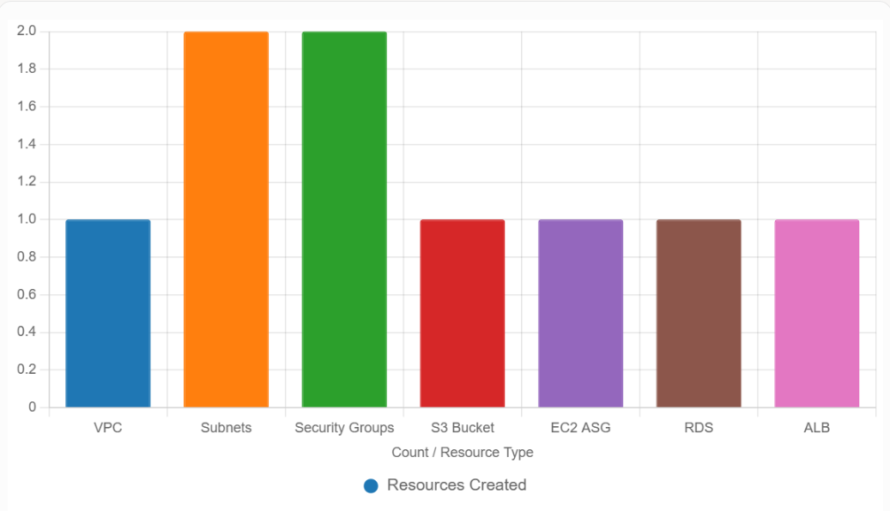

### Enterprise Project Assumptions
- **Application**: A web application with a frontend (S3-hosted static site), backend (EC2 instances in an Auto Scaling group), and database (RDS PostgreSQL).
- **Environment**: Multi-AZ deployment in a custom VPC for high availability.
- **Security**: Security groups, IAM roles, and encrypted resources.
- **Configuration**: Dynamic configuration via `Pulumi.dev.yaml` and environment variables.
- **Monitoring**: CloudWatch integration for logging and metrics.
- **CI/CD**: Outputs for integration with GitHub Actions or similar.
- **Scale**: Suitable for an enterprise with thousands of users, using Auto Scaling and load balancing.
- **Credentials**: Assumes AWS credentials are configured (via `aws configure` or environment variables) to resolve your earlier error (`No valid credential sources found`).

### Expanded Script
This script (`__main__.py`) deploys a full-stack enterprise application infrastructure. It assumes you’re working in `C:\Users\TECH\Documents\pulumi` with a `dev` stack and Python 3.12.


### Supporting Configuration (`Pulumi.dev.yaml`)
This configuration file allows you to customize the deployment:

```yaml
config:
  aws:region: us-east-1
  instance_type: t2.micro
  bucket_name: my-app-bucket-2025
  db_name: myappdb
  db_username:
    secure: v1:abc123...  # Use `pulumi config set --secret db_username admin`
  db_password:
    secure: v1:def456...  # Use `pulumi config set --secret db_password securepassword123`
  min_size: 2
  max_size: 4
  desired_capacity: 2
```

### IAM Policy
Ensure your AWS credentials have the necessary permissions. Here’s an expanded IAM policy:

```json
{
    "Version": "2012-10-17",
    "Statement": [
        {
            "Effect": "Allow",
            "Action": [
                "ec2:CreateVpc",
                "ec2:CreateSubnet",
                "ec2:CreateSecurityGroup",
                "ec2:AuthorizeSecurityGroupIngress",
                "ec2:AuthorizeSecurityGroupEgress",
                "ec2:CreateTags",
                "ec2:DescribeImages",
                "ec2:RunInstances",
                "ec2:CreateLaunchTemplate",
                "autoscaling:CreateAutoScalingGroup",
                "autoscaling:CreateOrUpdateTags",
                "s3:CreateBucket",
                "s3:PutBucketTagging",
                "s3:PutBucketAcl",
                "s3:PutBucketPolicy",
                "rds:CreateDBInstance",
                "rds:CreateDBSubnetGroup",
                "rds:ModifyDBInstance",
                "rds:CreateDBParameterGroup",
                "elasticloadbalancing:CreateLoadBalancer",
                "elasticloadbalancing:CreateTargetGroup",
                "elasticloadbalancing:CreateListener",
                "elasticloadbalancing:ModifyLoadBalancerAttributes"
            ],
            "Resource": "*"
        }
    ]
}
```

### Prerequisites
1. **AWS Credentials**:
   - Run `aws configure` or set environment variables:
     ```bash
     set AWS_ACCESS_KEY_ID=<your-access-key>
     set AWS_SECRET_ACCESS_KEY=<your-secret-key>
     set AWS_DEFAULT_REGION=us-east-1
     ```
   - Verify:
     ```bash
     aws sts get-caller-identity
     ```

2. **Pulumi Setup**:
   - Ensure Pulumi CLI is installed:
     ```bash
     pulumi version
     ```
     Update if needed:
     ```bash
     curl -fsSL https://get.pulumi.com | sh
     ```
   - Log in:
     ```bash
     pulumi login
     ```

3. **Python Dependencies**:
   - Install required packages:
     ```bash
     pip install pulumi pulumi_aws
     ```

4. **Secrets Management**:
   - Set sensitive configuration values:
     ```bash
     pulumi config set --secret db_username admin
     pulumi config set --secret db_password securepassword123
     ```

### How to Run
1. Save `__main__.py` and `Pulumi.dev.yaml` in `C:\Users\TECH\Documents\pulumi`.
2. Activate your virtual environment:
   ```bash
   C:\Users\TECH\Documents\pulumi\venv\Scripts\activate
   ```
3. Select the stack:
   ```bash
   pulumi stack select dev
   ```
4. Deploy:
   ```bash
   pulumi up
   ```
5. Check `pulumi_deployment.log` for logs if issues arise.

### Expected Outputs
The script deploys:
- A VPC with two subnets across availability zones.
- Security groups for web and database access.
- An S3 bucket for static content (publicly accessible).
- An Auto Scaling group with EC2 instances behind an Application Load Balancer.
- A PostgreSQL RDS instance with multi-AZ deployment.
- Exports for VPC ID, subnet IDs, bucket ARN, ASG name, DB endpoint, and ALB DNS name.

Example terminal output:
```
Resources:
    + 12 to create
Outputs:
    vpc_id: "vpc-12345678"
    subnet_ids: ["subnet-12345678", "subnet-87654321"]
    bucket_name: "my-app-bucket-2025"
    bucket_arn: "arn:aws:s3:::my-app-bucket-2025"
    asg_name: "app-asg"
    db_endpoint: "myappdb.123456.us-east-1.rds.amazonaws.com:5432"
    alb_dns_name: "app-alb-123456.us-east-1.elb.amazonaws.com"
```

### Why This Script is Enterprise-Grade
- **Scalability**: Uses Auto Scaling and multi-AZ RDS for high availability.
- **Modularity**: Classes encapsulate resources, making the code reusable and maintainable.
- **Security**: Includes security groups, private subnets, and secret management for sensitive data.
- **Logging**: Comprehensive logging for auditing and debugging.
- **Configuration**: Dynamic configuration via `Pulumi.dev.yaml` and secrets.
- **CI/CD Readiness**: Exports outputs for pipeline integration.
- **Error Handling**: Robust try-catch blocks to catch and log failures.
- **Best Practices**: Tags resources, uses explicit providers, and retrieves dynamic AMIs.

### Additional Features for Enterprise Needs
- **Monitoring**: Add CloudWatch alarms for CPU utilization:
  ```python
  aws.cloudwatch.MetricAlarm(
      "cpu-alarm",
      comparison_operator="GreaterThanThreshold",
      evaluation_periods=2,
      metric_name="CPUUtilization",
      namespace="AWS/EC2",
      period=300,
      statistic="Average",
      threshold=80,
      alarm_actions=[],
      dimensions={"AutoScalingGroupName": asg.get_asg_name()},
      opts=pulumi.ResourceOptions(provider=aws_provider)
  )
  ```
- **CI/CD Integration**: Use outputs in a GitHub Actions workflow:
  ```yaml
  steps:
    - run: pulumi stack output alb_dns_name > alb_dns.txt
  ```
- **Cost Management**: Add budget alerts via AWS Budgets or tag-based cost allocation.

### Troubleshooting
- **Credentials Error**: If you see "No valid credential sources found," ensure AWS credentials are set and have the required IAM permissions.
- **Resource Limits**: Check AWS service quotas (e.g., VPCs, RDS instances) in your account.
- **Debugging**: Run `pulumi up --debug` and check `pulumi_deployment.log`.
- **Network Issues**: Ensure internet connectivity for Pulumi and AWS APIs.

### Next Steps
- Deploy the script and verify resources in the AWS Management Console.
- Add more resources (e.g., Lambda, ECS, or DynamoDB) if needed.
- Integrate with a CI/CD pipeline (I can provide a GitHub Actions workflow if desired).
- If you want a visualization (e.g., a chart of resource counts), I can generate one:
  

